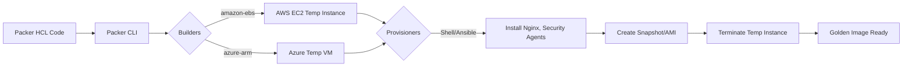

# Overview
**Packer kya hai?**
Packer ek open-source tool hai jo HashiCorp ne banaya hai. Ye ek hi source configuration file se multiple platforms (AWS AMI, Azure VHD, Docker image, VMware VMDK) ke liye identical (same) machine images create karta hai. Ye "Immutable Infrastructure" pattern ka core hai, jahan hum running servers ko patch ya update nahi karte, balki nayi image banakar purane servers ko replace kar dete hain.

**Kyu use hota hai?**
Bina Packer ke, hume manually VM banana padta, usme login karke Nginx/Apache install karna padta, fir snapshot lekar image banani padti. Ye slow aur manual hai. Packer is puri process ko HCL (HashiCorp Configuration Language) code ke through automate kar deta hai. 

**Real-life Analogy:**
Jese car factory me ek 'mould' (saancha) hota hai jisse hazaro identical cars banti hain. Packer wo mould banane ka automation tool hai. Aap script me likhte ho ki OS konsa hoga aur usme kya software chahiye. Packer cloud me jayega, VM banayega, sab install karega, uska 'Snapshot' ya 'AMI' (Golden Image) banayega, aur fir VM delete kar dega. Ab aap is image se kitne bhi identical servers launch kar sakte ho seconds me.

**Industry kaha use karti hai?**
CI/CD pipelines me Golden AMIs banane ke liye jisme application code, security agents (Splunk, CrowdStrike), aur OS patches pre-installed hote hain. Terraform ya Auto Scaling Groups (ASG) in AMIs ka use karke fast servers launch karte hain.

**Architecture Diagram:**



# Working
**Internal Working:**
1. **Initialize:** Packer required plugins (like AWS, Azure) ko download karta hai.
2. **Build:** Ek temporary VM launch karta hai (jaise AWS me `t2.micro`).
3. **Provision:** Temporary VM me SSH/WinRM se connect karke scripts ya Ansible playbook run karta hai.
4. **Image Creation:** VM ka snapshot/image create karta hai.
5. **Cleanup:** Temporary VM ko delete kar deta hai.

**Components:**
- **Builders:** Ye decide karte hain ki image KAHAN banegi (AWS, Azure, Docker).
- **Provisioners:** Ye decide karte hain ki image ke ANDAR KYA install hoga (Shell, Ansible, Chef).
- **Post-Processors:** Image banne ke baad ke tasks (e.g., Image ko kisi specific region me copy karna ya Docker image ko registry me push karna).

# Installation

**Prerequisites:**
- AWS Account and IAM User with EC2 full access.
- Local machine (Windows/Linux/Mac).

**Installation:**
1. Download from [HashiCorp Website](https://developer.hashicorp.com/packer/downloads).
2. Extract the binary and add it to your System PATH.
3. For Linux/macOS using Brew: `brew tap hashicorp/tap && brew install hashicorp/tap/packer`

**Configuration (AWS Credentials):**
Set environment variables taaki Packer AWS se connect kar sake.
```bash
export AWS_ACCESS_KEY_ID="your_key"
export AWS_SECRET_ACCESS_KEY="your_secret"
export AWS_DEFAULT_REGION="us-east-1"
```

**Verification:**
```bash
packer version
```

**Rollback:**
Simply delete the packer binary from your PATH.

# Practical Lab
**Scenario:** Automate creation of a custom Ubuntu AMI with Nginx pre-installed.

**Step 1: Create Packer Template (`nginx-ami.pkr.hcl`)**
```hcl
packer {
  required_plugins {
    amazon = {
      version = ">= 1.2.8"
      source  = "github.com/hashicorp/amazon"
    }
  }
}

source "amazon-ebs" "ubuntu" {
  ami_name      = "packer-nginx-ubuntu-${formatdate("YYYYMMDDhhmmss", timestamp())}"
  instance_type = "t2.micro"
  region        = "us-east-1"
  source_ami_filter {
    filters = {
      name                = "ubuntu/images/*ubuntu-focal-20.04-amd64-server-*"
      root-device-type    = "ebs"
      virtualization-type = "hvm"
    }
    most_recent = true
    owners      = ["099720109477"] # Canonical
  }
  ssh_username = "ubuntu"
}

build {
  name = "learn-packer"
  sources = [
    "source.amazon-ebs.ubuntu"
  ]

  provisioner "shell" {
    inline = [
      "echo Installing Nginx",
      "sleep 30",
      "sudo apt-get update",
      "sudo apt-get install -y nginx",
      "sudo systemctl enable nginx"
    ]
  }
}
```

**Step 2: Initialize & Format**
```bash
packer init nginx-ami.pkr.hcl
packer fmt nginx-ami.pkr.hcl
```

**Step 3: Validate & Build**
```bash
packer validate nginx-ami.pkr.hcl
packer build nginx-ami.pkr.hcl
```

**Expected Output:** Packer output dikhayega ki usne EC2 banaya, Nginx install kiya, AMI banayi aur EC2 delete kar diya. End me AMI ID print hogi (e.g., `ami-0123456789abcdef0`).

**Verification:** AWS Console me jaakar AMIs section me check karo, nayi image waha dikhegi.

# Daily Engineer Tasks
- **L1/L2 Engineer:** Existing Packer builds ko monitor karna, pipeline failures (jaise timeout) par basic troubleshooting karna, aur failed temp instances ko manual clean karna agar wo atak jaye.
- **L3/Senior Engineer:** Base images ko secure karna, nayi tools/agents add karna packer HCL me, aur multi-region replication set up karna. Packer aur Ansible ka integration sambhalna.
- **DevOps/Cloud Engineer:** CI/CD pipeline (Jenkins/GitHub Actions) banana jisme code commit hote hi Packer automatically Golden AMI banaye.

# Real Industry Tasks
- **Security Patching:** Har mahine OS patch update hoti hai. Security team bolti hai "Critical vulnerabilities fix karni hain". DevOps engineer nayi Packer build trigger karta hai latest OS base image ke sath aur nayi AMI release karta hai.
- **Agent Upgrades:** Splunk ya CrowdStrike ka naya version aaya hai. Packer template me provisioner script change karke AMI update ki jaati hai.
- **Migration:** AWS se Azure jana hai? Same provisioner script use hogi, bas builder AWS ke jagah `azure-arm` daalna padega.

# Troubleshooting

| Problem | Symptoms | Possible Root Causes | Investigation / Resolution |
| :--- | :--- | :--- | :--- |
| **SSH Timeout** | "Timeout waiting for SSH" error. | Security Group port 22 allow nahi kar raha, ya VPC internet connected nahi hai. | AWS Console me temp instance ka SG check karo. Agar private subnet hai, toh VPN/Bastion via connect karna padega. |
| **Apt-get lock error** | `Could not get lock /var/lib/dpkg/lock` | Cloud-init (OS boot process) abhi chal raha hai jab Packer apna apt-get start karta hai. | Provisioner shell script me sabse upar `sleep 30` add karo taaki OS boot complete ho jaye. |
| **AMI Name Conflict** | `AMI Name already exists` | Hardcoded AMI name use kiya hai. | `timestamp()` function use karo: `ami_name = "my-ami-${timestamp()}"` |
| **Build Stuck** | Stopping instance pe hang ho jata hai | Script me koi foreground process chal raha hai jo exit nahi ho raha (jaise `nginx` bina `-d`). | Background processes properly daemonize hone chahiye. Service ko `systemctl start` mat karo build phase me, sirf `enable` karo. |

# Interview Preparation

**Basic:**
- **Q:** What is Packer?
  - **A:** Open-source tool for automating the creation of identical machine images across multiple platforms (AWS, Azure, Docker) from a single code base.

**Intermediate:**
- **Q:** What are Builders and Provisioners in Packer?
  - **A:** Builder creates the VM on a specific platform (e.g., `amazon-ebs`). Provisioner installs software inside that VM (e.g., `shell`, `ansible`).

**Advanced / Production:**
- **Q:** How do Packer and Terraform work together?
  - **A:** They are complementary. Packer *builds* the Golden AMI with all software pre-installed. Terraform *deploys* the infrastructure (VPC, ASG, Load Balancer) using that Golden AMI.
- **Q:** Why use Ansible with Packer instead of shell scripts?
  - **A:** Shell scripts complex scenarios me messy ho jate hain. Ansible declarative aur idempotent hai. Hum Ansible roles ko directly Packer me call kar sakte hain via `ansible` provisioner, making the build code clean and reusable.

**Scenario Based:**
- **Q:** Developer says scaling instances takes 15 minutes because UserData script downloads and installs everything on boot. How to fix?
  - **A:** Move all installation logic to Packer. Bake everything into a Golden AMI. Instances boot up fast because everything is already installed. Sirf configuration inject karne ke liye chhota UserData use karenge.

# Production Scenarios

**Scenario:** Pipeline failed because Packer couldn't authenticate to AWS.
- **How to think:** Check how pipeline passes AWS credentials. Are they expired? Does the IAM role have `ec2:CreateImage` permissions?
- **Investigation:** Check CI/CD logs. Verify IAM Policy attached to the Jenkins worker/GitHub Runner.
- **Resolution:** Attach proper policy `AmazonEC2FullAccess` (or least privilege custom policy) to the role.

**Scenario:** Temporary instances created by Packer are not getting deleted when build fails.
- **How to think:** Cloud cost is increasing due to dangling resources. 
- **Resolution:** Use AWS tag policies. Add a tag `created-by: packer` in the builder block. Write a Lambda function or simple cron script that deletes any running instance with this tag older than 2 hours.

# Commands

| Command | Purpose | Syntax | Danger Level |
| :--- | :--- | :--- | :--- |
| `packer init` | Required plugins download karta hai | `packer init file.pkr.hcl` | Low |
| `packer fmt` | HCL code ki formatting fix karta hai | `packer fmt .` | Low |
| `packer validate` | Syntax and logic errors check karta hai | `packer validate template.pkr.hcl` | Low |
| `packer build` | AMI/Image banata hai | `packer build template.pkr.hcl` | High (creates cloud resources) |
| `packer inspect` | Template ke components (builders/provisioners) dikhata hai | `packer inspect template.pkr.hcl` | Low |

# Cheat Sheet
- **Immutable Infrastructure:** Server replace karo, patch mat karo.
- **Builder:** `amazon-ebs`, `azure-arm`, `docker`.
- **Provisioner:** `shell`, `ansible`, `file`, `powershell`.
- **HCL2:** Modern syntax, like Terraform.
- **`timestamp()`:** Hamesha unique AMI name dene ke liye use karo.
- **Most common combo:** Packer + Ansible (to build) -> Terraform (to deploy).

# SOP & Runbook & KB Article

**SOP: Creating a new Golden AMI Release**
- **Purpose:** Securely create and publish new base images.
- **Procedure:** 
  1. Create feature branch. 
  2. Update software versions in Ansible/Shell provisioners. 
  3. Run `packer validate`. 
  4. Raise PR. 
  5. Merge triggers Jenkins job which runs `packer build`.
- **Validation:** Deploy a test EC2 from the new AMI and verify Nginx service status.

**Runbook: Dangling Packer Resources**
- **Detection:** AWS Cost Explorer shows unattached EBS volumes or stray EC2s.
- **Investigation:** Check instances starting with `packer-builder`.
- **Resolution:** Manually terminate EC2 and delete associated Snapshots/AMIs. Fix CI/CD pipeline to ensure cleanup on failure (using `-force` or cleanup scripts).

**KB Article: SSH Timeout during Packer Build**
- **Problem:** Packer build fails with "Timeout waiting for SSH".
- **Environment:** AWS, private subnets.
- **Cause:** No route to the instance or port 22 blocked by SG.
- **Resolution:** Attach a Security Group that allows port 22 from the Packer runner's IP. Alternatively, configure SSM Agent to connect without SSH.

# Best Practices & Beginner Mistakes

**Best Practices:**
- Use `timestamp()` for unique AMI names.
- Always use `packer fmt` before committing code.
- Prefer Ansible over large, complex Shell scripts.
- Only include what is strictly necessary in the Golden Image to keep size small and boot time fast.
- Run security scans (like Trivy or Inspector) on the created AMI before tagging it as 'Production-Ready'.

**Beginner Mistakes:**
- **Putting secrets in AMIs:** Never bake AWS Keys or DB passwords into an image! Use AWS Secrets Manager or Parameter Store at runtime.
- **Forgetting `sleep`:** Not giving cloud-init time to finish before running `apt-get`, causing lock errors.
- **Bloated Images:** Installing massive unnecessary packages making the AMI 20GB+.

# Advanced Concepts
**Sysprep on Windows:** If you use Packer for Windows Server AMIs, you MUST run Sysprep as the last step in your provisioner to generalize the image, otherwise new instances will have identical SIDs and fail to join domains properly.

**Packer vs Docker:** Packer VM/cloud images (AMI, VHD) ke liye primary use hota hai. Docker images ke liye log generally `Dockerfile` use karte hain, halanki Packer me Docker builder bhi hota hai.

**Packer Plugins:** Packer modular hai. Agar aapko koi custom cloud provider chahiye, toh aap Go language me apna custom plugin (builder) likh sakte ho.

# Related Topics & Flashcards & Revision
- **Related:** [[TERRAFORM-01 Terraform Basics]], [[AWS-02 EC2 and Auto Scaling]], [[Ansible-01 Overview]], [[Master Index]]
- **Flashcard:** `Packer Provisioner vs Builder` -> Builder cloud me temp VM banata hai (AWS EBS). Provisioner andar software install karta hai (Shell/Ansible).
- **Revision Schedule:** 5 min (Commands), 15 min (Architecture/Working), Interview Prep (Night before).
