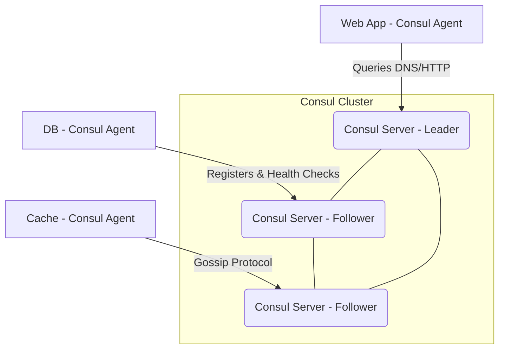

# Consul

# Overview
**Ye kya hai?**
Consul, by HashiCorp, ek multi-cloud service networking platform hai. Iske 3 main kaam hain: Service Discovery, Health Checking, aur Key-Value (KV) store.
Aajkal ke dynamic microservices environment mein jahan containers ka IP address hamesha change hota rehta hai, Consul ek central "Telephone Directory" ki tarah kaam karta hai. Services ek dusre ko IP se nahi, balki unke "Naam" se find karti hain.

**Kyu use hota hai?**
Jab 100+ microservices chal rahi ho, toh har kisi ka IP manually track karna impossible hai. Consul automatically track karta hai ki kaunsi service kahan chal rahi hai aur kya wo healthy hai.

**Real life example / Simple analogy:**
Socho Consul ek 'Phonebook' ya 'JustDial' hai. Agar `Web` server ko `Database` se baat karni hai, toh use DB ka IP yaad rakhne ki zaroorat nahi. Wo Consul se puchega, "Bhai DB ka address kya hai?". Consul check karega kaunsa DB server zinda (healthy) hai aur uska address de dega. Naya server aayega toh wo apna naam Consul me likhwa dega (Register).

**Real production use-case:**
Production mein jab AWS Auto Scaling naye EC2 instances ya EKS naye pods banata hai, toh unka IP dynamic hota hai. Consul ensure karta hai ki traffic hamesha naye aur healthy IPs par hi jaye.

**Architecture (Mermaid Diagram)**


# Working
**Internal working:**
Consul ek Server-Client architecture par chalta hai. 
- **Consul Servers:** Cluster ka state, KV data, aur Raft consensus (leader election) handle karte hain. HA ke liye 3 ya 5 servers hote hain.
- **Consul Clients (Agents):** Har EC2 instance/Node par chalte hain. Ye lightweight hote hain. Inka kaam hai apni node ki services ko register karna, unka health check karna, aur DNS/HTTP queries ko server tak bhejna.

**Data flow & Protocols:**
- **LAN Gossip (Port 8301 UDP/TCP):** Agents aapas mein baat karke dead nodes detect karte hain (Serf protocol).
- **Raft (Port 8300 TCP):** Servers aapas mein state replicate karte hain.
- **DNS (Port 8600 TCP/UDP):** Apps dusri services ko resolve karti hain (`app.service.consul`).
- **HTTP/HTTPS (Port 8500/8501 TCP):** API queries aur UI ke liye.

# Installation
**Prerequisites:** 
Linux server, basic networking knowledge. Docker for local lab.

**Installation (Ubuntu):**
```bash
# Add HashiCorp GPG key and repo
wget -O- https://apt.releases.hashicorp.com/gpg | sudo gpg --dearmor -o /usr/share/keyrings/hashicorp-archive-keyring.gpg
echo "deb [signed-by=/usr/share/keyrings/hashicorp-archive-keyring.gpg] https://apt.releases.hashicorp.com $(lsb_release -cs) main" | sudo tee /etc/apt/sources.list.d/hashicorp.list

# Install Consul
sudo apt update && sudo apt install consul
```

**Verification:**
```bash
consul version
```

# Practical Lab
**Scenario:** Single-node Consul server Docker me chalana, ek dummy service register karna, aur DNS se resolve karna.

**Step 1: Start Consul in Development Mode**
*(Note: Dev mode RAM me chalta hai, prod me mat use karna!)*
```bash
docker run -d --name consul-dev -p 8500:8500 -p 8600:8600/udp hashicorp/consul agent -dev -client=0.0.0.0
```
*UI URL: http://localhost:8500*

**Step 2: Create a Service Definition File (`web-service.json`)**
```json
{
  "ID": "web1",
  "Name": "web",
  "Tags": ["primary", "v1"],
  "Address": "192.168.1.50",
  "Port": 80,
  "Check": {
    "HTTP": "http://example.com/",
    "Interval": "10s"
  }
}
```

**Step 3: Register the Service (API ke through)**
```bash
curl -X PUT --data-binary @web-service.json http://localhost:8500/v1/agent/service/register
```

**Step 4: Query via Consul DNS**
Consul automatically DNS banata hai `.consul` TLD ke sath.
```bash
dig @127.0.0.1 -p 8600 web.service.consul +short
# Output aayega: 192.168.1.50
```

**Step 5: Write/Read from KV Store**
```bash
# Write
curl -X PUT -d 'prod-db.example.com' http://localhost:8500/v1/kv/myapp/db_host
# Read
curl http://localhost:8500/v1/kv/myapp/db_host?raw
```

# Daily Engineer Tasks
- **L1/L2 Engineer:** Health check alerts ko monitor karna. Dead nodes ko cluster se force-leave karna.
- **L3/Senior Engineer:** Consul cluster ki health, Raft latency, aur backup/restore operations handle karna.
- **DevOps/Cloud Engineer:** Consul cluster ko Terraform se provision karna, TLS/Gossip encryption set karna, Consul Template aur Vault ke sath integrate karna.

# Real Industry Tasks
- **Cluster Upgrade:** Zero downtime ke sath Consul versions upgrade karna (rolling upgrade).
- **Service Mesh Implementation:** Consul Connect (mTLS) enable karna taaki do services aapas me secure encrypted communication kar sake bina code change kiye.
- **Cross-Datacenter Federation:** AWS (us-east-1) ke Consul ko Azure (eastus) ke Consul se connect karna multi-cloud routing ke liye.

# Troubleshooting
- **Problem:** Split-brain (Cluster has no leader)
  - **Symptoms:** `rpc error: No cluster leader` in logs. No new writes are accepted.
  - **Root Cause:** Network partition ya majority nodes (quorum) ka down ho jana. Example: 3 me se 2 server down.
  - **Resolution:** `peers.json` banakar bache hue nodes ko manually raft peers declare karna padta hai taaki nayi election ho sake. (Disaster Recovery).

- **Problem:** DNS returning NXDOMAIN for an existing service.
  - **Symptoms:** `dig app.service.consul` gives NXDOMAIN.
  - **Root Cause:** Service fail ho chuki hai apni health check mein. Consul ne use DNS se hata diya hai.
  - **Resolution:** Consul UI me jaao, dekho "Failing Checks". App ke logs check karo ki /health endpoint 200 OK kyu nahi de raha.

# Interview Preparation
**1. Consul vs etcd vs ZooKeeper me kya difference hai?**
- *Expected Answer:* Teeno distributed KV store hain. `etcd` Kubernetes ka backbone hai, fast hai but usme in-built DNS service discovery nahi hai. `ZooKeeper` Hadoop/Kafka ecosystem me use hota hai, thoda purana aur complex hai. `Consul` specially Service Discovery aur Health Checks ke liye bana hai aur isme out-of-the-box DNS server aur UI hota hai.

**2. Gossip protocol kya hota hai?**
- *Expected Answer:* Ye ek decentralized peer-to-peer communication protocol hai. Ek node randomly dusre nodes ko apni state batata hai. Jaise virus failta hai, waise hi cluster state ki information (e.g., Node X is down) milliseconds me pure cluster me fail jati hai bina central server par load daale.

**3. Agar 5 node ka Consul Server cluster hai, aur 2 down ho jayein toh kya hoga?**
- *Expected Answer:* Cluster chalta rahega. Raft consensus require karta hai (N/2)+1 nodes for quorum. 5 node me quorum 3 hota hai. Agar 2 down hain, tab bhi 3 bache hain, toh cluster read/write operation perform karta rahega.

**4. Consul KV vs Environment Variables me kya better hai?**
- *Expected Answer:* Env variables ke liye container/app restart karna padta hai. Consul KV dynamic hai. Agar aap `consul-template` use karte ho, toh value change hote hi aapki application apna config reload kar legi bina downtime ke.

# Production Scenarios
**Scenario: Database Failover Sub-Second Routing**
- **How to think:** Ek legacy app hai jiska Master DB ka IP hardcoded hai. DB team jab Master fail hota hai toh Slave ko Master banati hai, par App team ko batane aur config change karne me 10 minute ka downtime lagta hai.
- **Resolution:** Consul implement karo. DB team Consul KV me `config/db_primary_ip` ko update karegi script ke through. Web servers pe `consul-template` chalega jo KV ko watch karega. Jaise hi IP change hoga, wo nginx/app ka config rewrite karke graceful reload kar dega. Zero human intervention, sub-second failover.

# Commands
| Command | Purpose |
| :--- | :--- |
| `consul members` | Cluster ke sabhi agents/servers ki list aur status (alive/failed) dikhata hai. |
| `consul info` | Agent aur server ki detailed stats (raft, memory, datacenter) batata hai. |
| `consul kv put db/port 3306` | Key-value store me data likhna. |
| `consul kv get db/port` | KV store se data read karna. |
| `consul catalog services` | Cluster me registered saari services ki list nikalna. |
| `consul force-leave <node>` | Agar koi dead node permanently delete karna ho cluster se. |
| `consul reload` | Agent ki configuration hot-reload karna bina process kill kiye. |

# Cheat Sheet
- **Ports:** 8500 (HTTP/UI), 8600 (DNS), 8300 (Server RPC), 8301 (LAN Gossip).
- **Quorum Rule:** `(N/2)+1` (3 node cluster = 2 ki quorum, 5 node = 3).
- **Log Location:** `/var/log/consul/` ya `journalctl -u consul`
- **DNS Query Format:** `<service>.service.<datacenter>.consul` (default DC is dc1)

# SOP & Runbook & KB Article
**SOP: Adding a New Consul Server to an Existing Cluster**
1. **Purpose:** Increase fault tolerance.
2. **Procedure:** Install Consul -> Copy TLS certs -> Configure `consul.hcl` with `retry_join` pointing to existing servers -> Start service.
3. **Validation:** Run `consul members` and ensure the new node shows up as `server` and `alive`.

**Runbook: Consul High Memory Usage Alert**
1. **Detection:** Prometheus/Grafana alerts on memory > 85%.
2. **Investigation:** Check if some app is dumping huge data into Consul KV (Consul KV is not for large objects). Run `consul kv get -recurse` (careful in prod) or check metrics.
3. **Resolution:** Delete unnecessary large keys. Ensure snapshot retention is configured.

# Best Practices & Beginner Mistakes
**Best Practices:**
- Server nodes ko humesha odd number me rakho (3, 5, 7) for Raft quorum.
- Gossip traffic (8301) aur RPC traffic (8300) ko hamesha encrypt karo (TLS & Gossip Key).
- Consul UI (8500) ko direct public internet par kabhi expose mat karo.
- Automated snapshot backups enable karke rakho S3 bucket mein.

**Beginner Mistakes:**
- Consul KV me bade files (megabytes ki) store karna. (Consul memory me KV rakhta hai, server crash ho jayega).
- `consul agent -dev` ko production me use kar lena.
- Firewall rules me sirf TCP allow karna. Gossip protocol ke liye UDP zaroori hai.

# Advanced Concepts
**Consul Connect (Service Mesh):**
Aajkal Consul sirf DNS nahi, balki Service Mesh ka kaam bhi karta hai. Sidecar proxies (Envoy) har app ke sath chalte hain. Jab App A ko App B se baat karni hoti hai, toh traffic Envoy proxy ke through jata hai, jo automatic mTLS encryption (Mutual TLS) lagata hai aur Intention rules check karta hai (ki kya A ko B se baat karne ki permission hai?).

**Prepared Queries:**
Agar "Nearest" healthy service dhundni ho multi-region me, toh Prepared Queries use hoti hain (Geo-failover routing).

# Related Topics & Flashcards & Revision
- [[TERRAFORM-01 Terraform Basics]]
- [[KUBERNETES-04 Services and Ingress]]
- [[TOOLS-03 Vault]] (Usually Consul KV is used as a backend for HashiCorp Vault)

**Flashcards:**
- Q: What port is Consul DNS? A: 8600
- Q: What consensus protocol does Consul use? A: Raft
- Q: Does Gossip use TCP or UDP? A: Both, mostly UDP.

# Real Production Logs & Commands & Decision Tree
**Sample Error Log:**
```log
[WARN] consul: Health check for service 'web' failed: Get "http://10.0.0.5/health": dial tcp 10.0.0.5:80: connect: connection refused
```
*Meaning:* Consul agent web service ko HTTP hit maar raha hai par connection refuse ho gaya. Nginx/App container crash ho gaya hai. Action: Start the app.

**Decision Tree (Troubleshooting Resolution):**
```mermaid
graph TD
    A[Can't resolve app.service.consul] --> B{Is Consul Agent running locally?}
    B -- No --> C[Start Consul Agent]
    B -- Yes --> D{Is the service registered?}
    D -- No --> E[Register the service]
    D -- Yes --> F{Is the Health Check passing?}
    F -- No --> G[Fix application/health endpoint]
    F -- Yes --> H[Check DNS forwarding (e.g. CoreDNS/systemd-resolved) config]
```
