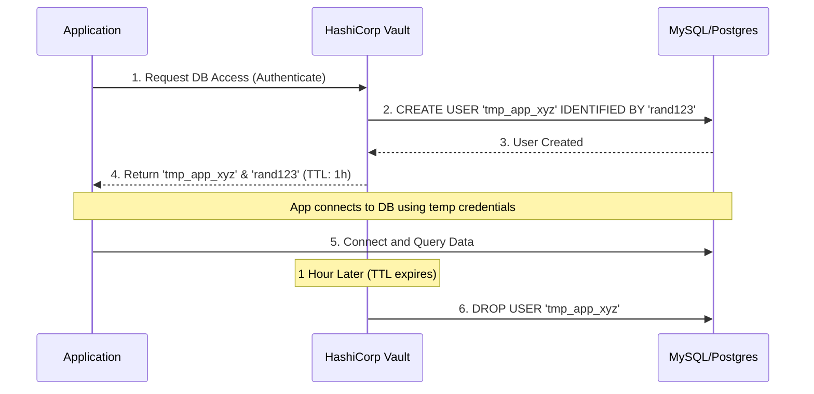
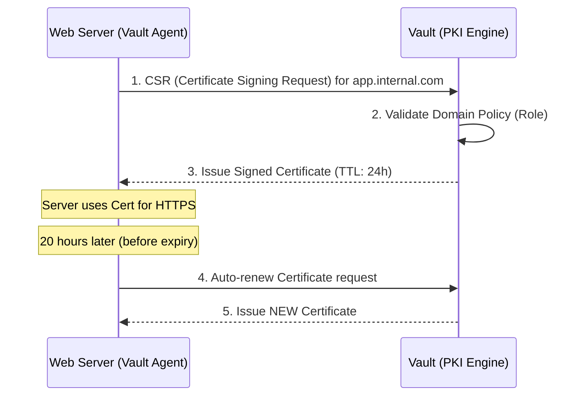
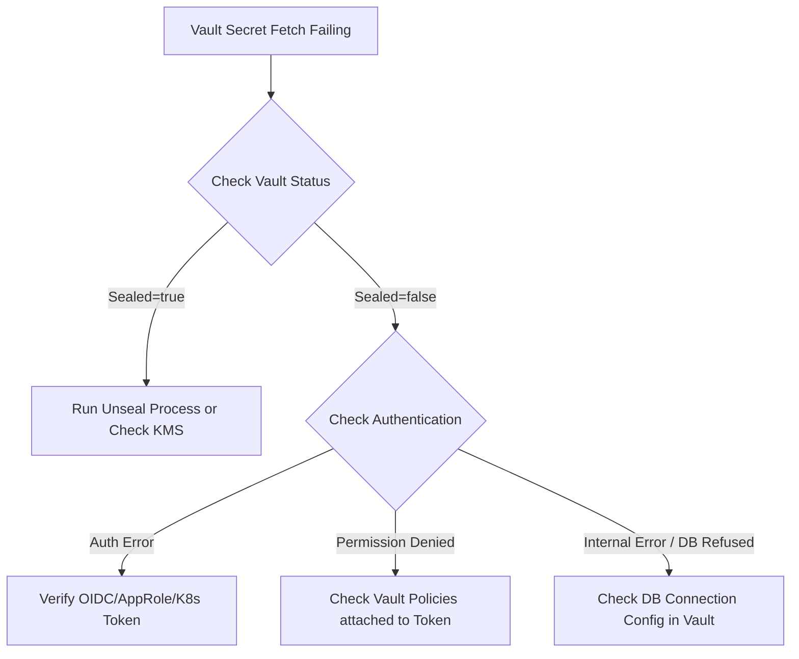

# Vault Advanced - PKI and Dynamic Secrets

# Overview
HashiCorp Vault sirf static passwords store karne ke liye nahi hota. Iski asli power **Dynamic Secrets** aur **PKI (Public Key Infrastructure)** me hai. 
- **Dynamic Secrets:** Jab bhi kisi app ko database access chahiye, Vault automatically ek naya, temporary DB user create karta hai (e.g., valid for 1 hour). 1 ghante baad, Vault us user ko automatically delete kar deta hai. Database me credential leak ka dar khatam!
- **PKI Engine:** Vault tumhara apna internal "Let's Encrypt" ban jata hai. Internal microservices ke liye TLS/SSL certificates dynamically issue karta hai.

*Simple Analogy:* Dynamic Secrets ek smart office guard ki tarah hai. Jab koi visitor aata hai, usko ek temporary ID card milta hai jo 2 ghante baad expire ho jayega. PKI Engine ek passport office hai jo instantly tumhare servers ko unki identity (certs) verify karne ke liye passport (certificate) issue karta hai.

# Visuals

## Dynamic Secrets Flow


## PKI Certificate Issuance Flow


# Working
- **Dynamic DB Secrets:** Vault root credentials ka use karke target database me connect karta hai. Jab app access mangti hai, Vault role based query run karta hai (like `CREATE USER... GRANT...`) aur temporary credentials banata hai. Vault ke internal registry me ek lease timer start ho jata hai. Lease expire hone par Vault user ko database se `DROP` kar deta hai.
- **PKI Secrets:** Vault ke andar root CA ya intermediate CA generate kiya jata hai. Admin ek Role define karta hai (jaise `*.company.local` allowed hai). Servers ko jab SSL cert chahiye, wo Vault API call karte hain (ya Vault Agent use karte hain). Vault private key aur signed cert generate karke return karta hai. In certs ki life choti (e.g., 24h) hoti hai taaki security tight rahe.

# Installation
## Prerequisites
- Vault Server running (Dev mode or HA mode with Raft storage).
- Vault token with admin privileges.
- Target system (MySQL, Postgres) for DB secrets.
- `jq` and `openssl` tools installed on client machines.

*(Note: Production installation requires setting up Vault with HA using Consul or Raft integrated storage, TLS for Vault API, and Auto-Unseal. This lab uses dev mode for learning).*

# Practical Lab

## Lab 1: Database Dynamic Secrets
**Goal:** Ek MySQL database connect karo aur Vault se temporary user generate karao.

### Step 1: Start MySQL and Vault Dev Server
```bash
# Terminal 1: Start Vault
vault server -dev -dev-root-token-id="root"

# Terminal 2: Start MySQL (Docker)
docker run --name mysql-vault -e MYSQL_ROOT_PASSWORD=secret -d -p 3306:3306 mysql:latest
```

### Step 2: Configure Vault Database Engine
```bash
export VAULT_ADDR='http://127.0.0.1:8200'
export VAULT_TOKEN='root'

# Enable Database secrets engine
vault secrets enable database

# Configure MySQL Connection
vault write database/config/my-mysql-database \
    plugin_name=mysql-database-plugin \
    connection_url="{{username}}:{{password}}@tcp(127.0.0.1:3306)/" \
    allowed_roles="my-role" \
    username="root" \
    password="secret"
```

### Step 3: Create a Role
```bash
# Define role that creates a read-only user, valid for 1 hour
vault write database/roles/my-role \
    db_name=my-mysql-database \
    creation_statements="CREATE USER '{{name}}'@'%' IDENTIFIED BY '{{password}}'; GRANT SELECT ON *.* TO '{{name}}'@'%';" \
    default_ttl="1h" \
    max_ttl="24h"
```

### Step 4: Request Dynamic Credentials
```bash
vault read database/creds/my-role
# Output me naya username (e.g., v-root-my-ro-...) aur password milega.
```

---

## Lab 2: PKI Certificates
**Goal:** Internal Let's Encrypt setup karna using Vault PKI.

### Step 1: Enable & Configure Root CA
```bash
vault secrets enable pki
vault secrets tune -max-lease-ttl=8760h pki

vault write -field=certificate pki/root/generate/internal \
    common_name="devops.local" \
    ttl=8760h > CA_cert.crt
```

### Step 2: Configure URLs
```bash
vault write pki/config/urls \
    issuing_certificates="$VAULT_ADDR/v1/pki/ca" \
    crl_distribution_points="$VAULT_ADDR/v1/pki/crl"
```

### Step 3: Create Role
```bash
vault write pki/roles/web-server \
    allowed_domains="devops.local" \
    allow_subdomains=true \
    max_ttl="72h"
```

### Step 4: Generate Cert
```bash
vault write -format=json pki/issue/web-server \
    common_name="app.devops.local" > cert.json

# Parse karke save karo
cat cert.json | jq -r '.data.certificate' > app.crt
cat cert.json | jq -r '.data.private_key' > app.key
```

# Daily Engineer Tasks
- **L1 Engineer:** Check Vault status `vault status`, restart Vault agent on VMs if certs are not renewing.
- **L2 Engineer:** Unseal Vault after a reboot. Check audit logs for failed auth requests. Create new roles for PKI.
- **L3/Senior Engineer:** Vault HA cluster architecture design. Raft storage debugging. Writing Terraform to manage Vault policies and DB roles. Setting up OIDC auth.
- **DevOps Engineer:** Injecting Vault secrets into Kubernetes pods via Vault Agent Injector or CSI driver. Automating certificate rotation.

# Real Industry Tasks
- **Migration:** Moving from hardcoded `.env` files to Vault Dynamic Secrets for a 50-microservice architecture.
- **Compliance:** Auditor asks for database access logs. You show them Vault's audit backend where every dynamic user creation and drop is recorded.
- **Outage Handling:** Certificate expiry caused an outage. Implement Vault Agent sidecar pattern in K8s to auto-renew PKI certs gracefully.

# Troubleshooting

## Issue: Database Dynamic Secret Request Fails
- **Symptoms:** `vault read database/creds/my-role` gives error `connection refused` or `access denied`.
- **Root Cause:** Vault server network pe database tak nahi pahunch pa raha, ya `root` credentials config me galat hain.
- **Investigation:** Check Vault logs. Verify Vault VM can ping/telnet the Database IP on port 3306/5432. 
- **Resolution:** Update network ACL/Security Groups. Fix DB credentials in Vault config using `vault write database/config/...`.

## Issue: Vault is Sealed
- **Symptoms:** API returns `503 Service Unavailable`, `vault status` shows `Sealed: true`.
- **Root Cause:** Vault container/VM restart hua, aur Auto-Unseal configured nahi hai. Data encrypted lock ho gaya.
- **Resolution:** Provide Unseal keys. 
  ```bash
  vault operator unseal (enter key 1)
  vault operator unseal (enter key 2)
  vault operator unseal (enter key 3)
  ```

## Issue: PKI Cert Trusted by Vault but Browser shows 'Not Secure'
- **Symptoms:** Cert is valid but Chrome shows NET::ERR_CERT_AUTHORITY_INVALID.
- **Root Cause:** Browser ko internal CA ke bare me nahi pata.
- **Resolution:** Tumhara generated Root CA (`CA_cert.crt`) saari client machines ke "Trusted Root Certification Authorities" store me push karna padega (via Active Directory GPO ya MDM).

# Interview Preparation

**Basic:**
1. **Q: Static vs Dynamic secrets me kya difference hai?**
   **A:** Static secret (jaise password) manual set aur rotate hota hai. Dynamic secret on-demand generate hota hai aur ek TTL ke baad apne aap destroy ho jata hai. Leak hone par impact kam hota hai.

**Intermediate:**
2. **Q: Vault me PKI engine ka kya use case hai?**
   **A:** Internal mTLS (mutual TLS) setup karne ke liye ya internal web servers ko short-lived SSL certs issue karne ke liye. Yeh internal Let's Encrypt jaisa kaam karta hai, automation allow karta hai.

**Advanced / Scenario Based:**
3. **Q: Vault DB secret expire hone se pehle Vault down ho gaya. Kya credential hamesha ke liye DB me reh jayega?**
   **A:** Nahi. Credentials tab tak kaam karenge jab tak target DB access allow karta hai. Lekin jab Vault wapas aayega, wo apna internal "Lease Registry" check karega. Agar koi lease Vault ke down time me expire ho chuka tha, Vault turant us user ko revoke/drop kar dega.
4. **Q: K8s pods me Vault certs aur secrets kaise deliver karte ho?**
   **A:** Hum **Vault Agent Sidecar Injector** use karte hain. Pod start hote time init container Vault se authenticate (using Kubernetes Auth Method) karta hai, secrets fetch karta hai, aur unhe memory volume (tmpfs) me mount karta hai taaki disk par save na ho.

# Production Scenarios

**Scenario: The "Production DB Password Leak" Panic**
- **Problem:** Ek developer ne galti se production DB password GitHub public repo par push kar diya. Security team is panicking.
- **Thinking Process:** Agar static password tha, toh turant database me jaakar password change karna padega, fir saari apps restart karni padengi naye password ke sath - jisse downtime hoga. 
- **With Vault Dynamic Secrets:** Agar leaked secret dynamic tha, pehli baat wo 1 ghante me expire ho jayega. Turant action ke liye: `vault lease revoke database/creds/my-role/leaked_lease_id`. Sirf wo leaked access band hoga, baaki production traffic chalta rahega.
- **Prevention:** Implement strict dynamic secrets, disallow long-lived static DB passwords.

# Commands

| Command | Purpose | When to use | Danger Level |
|---|---|---|---|
| `vault secrets enable <engine>` | Mounts new secret engine (like pki/database) | Initial setup | Low |
| `vault lease list <path>` | View active dynamic secrets | Auditing who has access | Low |
| `vault lease revoke <lease_id>` | Kill a dynamic secret instantly | Compromise detected | High (Kills app connection) |
| `vault operator unseal` | Unseals vault to read data | After Vault restart | Medium |
| `vault secrets tune -max-lease-ttl=...` | Modify engine max TTL | Tuning PKI expiry | Medium |

# Cheat Sheet
- **Default Port:** 8200
- **Data Storage:** Raft (Integrated) or Consul.
- **Dev Mode command:** `vault server -dev` (never use in prod).
- **Core Concept for PKI:** Root CA -> Intermediate CA -> Issue Role -> Certificate.
- **Core Concept for DB:** Vault DB Config -> Vault Role (SQL statement) -> Client requests Creds.

# SOP & Runbook & KB Article

## Runbook: Unsealing Vault Cluster
- **Detection:** Alerts fire for "Vault Status: Sealed". App fails to fetch secrets.
- **Investigation:** Run `vault status`. Check if `Sealed: true`.
- **Commands:** 
  1. Retrieve Unseal Key Shards from secure password manager (e.g., 1Password).
  2. Exec into vault node: `kubectl exec -it vault-0 -n vault -- sh`
  3. Run `vault operator unseal` multiple times until Threshold is met.
- **Validation:** `vault status` should show `Sealed: false`.
- **Prevention:** Setup Auto-Unseal using AWS KMS, Azure KeyVault, or GCP KMS.

# Best Practices & Beginner Mistakes

## Best Practices
- **Never use root token for daily ops:** Generate policies and use specific tokens or OIDC auth.
- **Use Short TTLs:** PKI certs ke liye 24h ya 7 days TTL rakho, aur Vault Agent se auto-renew karao. Dynamic DB secrets ke liye 1h TTL is standard.
- **Audit Logs:** Hamesha Vault Audit Logging enable karo (`vault audit enable file ...`) aur Splunk/ELK me forward karo.

## Beginner Mistakes
- **Mistake:** Manual certificate request and placement on servers.
  - **Impact:** Jab cert expire hota hai, production app down ho jati hai. 
  - **Correction:** Use Vault Agent templates to automate certificate renewal and Nginx reload.
- **Mistake:** Running Vault in Prod without TLS.
  - **Impact:** API calls are unencrypted, token can be sniffed.
  - **Correction:** Enforce end-to-end TLS.

# Advanced Concepts
## Auto-Unseal mechanism
Normally Vault starts in a sealed state (it cannot decrypt its own storage). It uses Shamir's Secret Sharing to split the master key into shards. For Auto-Unseal, Vault uses a trusted external Key Management Service (like AWS KMS). On startup, Vault sends its encrypted master key to AWS KMS, KMS decrypts it and sends it back. Vault uses this master key to decrypt the encryption key, which decrypts the data. Zero human touch required!

## Raft Integrated Storage
Pehle Vault ko data store karne ke liye Consul backend ki zarurat thi (jisme complex management hota tha). Ab Vault me **Raft** consensus protocol inbuilt hai. Vault nodes khud apna cluster banate hain, leader elect karte hain, aur encrypted data direct disk pe store karke aapas me replicate karte hain.

# Related Topics & Flashcards & Revision
- [[DEVSECOPS-02 Secrets Management]]
- [[DB-01 Database Administration Basics]]
- [[KUBERNETES-15 Vault Integration]]

## Flashcards
- **Q:** Vault Agent ka main kaam kya hai? -> **A:** Secrets aur Certificates auto-fetch aur auto-renew karna (TTL expire hone se pehle).
- **Q:** Shamir's Secret Sharing kya karta hai Vault me? -> **A:** Master key ko multiple unseal shards me split karta hai.

# Real Production Logs & Commands & Decision Tree

## Audit Log Example
```json
{
  "time": "2026-06-27T10:00:00Z",
  "type": "response",
  "auth": {
    "display_name": "oidc-john.doe"
  },
  "request": {
    "operation": "read",
    "path": "database/creds/readonly"
  },
  "response": {
    "secret": {
      "lease_id": "database/creds/readonly/xxxx"
    }
  }
}
```
*Explanation:* Ye log clear bata raha hai ki `john.doe` ne `readonly` DB secret access kiya. Kal ko koi unauthorized DB activity hoti hai, toh is lease_id se hum real user track kar sakte hain.

## Troubleshooting Decision Tree

