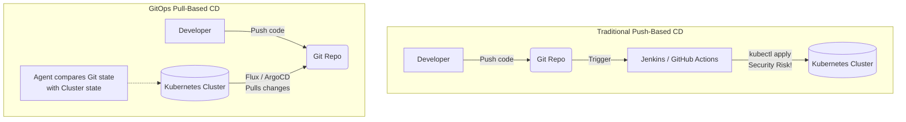

# MISC-01 GitOps: Flux vs ArgoCD

# Overview
**Ye kya hai?** GitOps ek operational framework hai jahan hum DevOps ke best practices (jaise version control, CI/CD, aur collaboration) ko infrastructure aur application deployment par apply karte hain. Iska main funda hai ki aapka **Git repository hi single source of truth** hoga. Jo Git mein hai, wahi cluster mein hona chahiye.

**Kyu use hota hai?** Traditional CI/CD (Push-based) mein Jenkins bahar se Kubernetes ke andar ghus kar changes daalta tha (jiske liye usko cluster admin access chahiye tha - security risk!). GitOps (Pull-based) mein, cluster ke andar hi ek agent (jaise Flux ya ArgoCD) baitha hota hai jo continuously Git repo ko monitor karta hai aur changes khud pull karke apply karta hai. Isme cluster ki chabi bahar nahi deni padti.

**Real life example / Desi Analogy:**
- **Push-based CD (Traditional):** Zomato/Swiggy delivery boy (Jenkins) jisko aapke society (Kubernetes) ke andar aane ke liye gate ki chabi chahiye.
- **Pull-based CD (GitOps):** Aapki society ka watchman (Flux/ArgoCD) jiske paas ek list (Git Repo) hai. Watchman list check karta hai, aur jo naya saaman (app updates) chahiye, wo khud laakar society mein rakh deta hai. Society bahar walo se secure rehti hai.

**Industry kaha use karti hai?** Har modern Kubernetes environment mein jahan security, auditability, aur zero-touch deployments chahiye. FAANG aur top startups ab `kubectl apply` use nahi karte, sab kuch Git commit ke through automate hota hai.

**Mermaid Diagram: Push vs Pull Architecture**


# Working
**Internal working & Flow:**
1. **Developer Commits Code:** Developer YAML manifests (Helm, Kustomize) ko Git mein push karta hai.
2. **Reconciliation Loop:** GitOps agent (Flux/ArgoCD) lagatar (usually every 1-3 mins) Git repo ko poll karta hai.
3. **State Comparison:** Agent check karta hai ki Git (Desired State) aur Cluster (Actual State) mein koi difference (Drift) toh nahi hai.
4. **Synchronization:** Agar drift milta hai (kisi ne manual change kiya ho, ya naya commit aaya ho), agent automatically changes ko cluster mein apply kar deta hai (Self-Healing).

**Flux vs ArgoCD:**
- **ArgoCD:** Centralized architecture. Ek UI hota hai jahan sab kuch dikhta hai. Multi-cluster deployments ke liye best hai. Custom Resource `Application` use karta hai.
- **Flux (v2):** Decentralized, native Kubernetes feel. GitOps Toolkit pe based hai (Source Controller, Kustomize Controller, Helm Controller). UI by default nahi hota, sab Git se manage hota hai.

# Installation
## Prerequisites
- Ek running Kubernetes Cluster (Minikube, EKS, AKS, etc.)
- `kubectl` configured.
- GitHub personal access token (PAT) with `repo` permissions.

## ArgoCD Installation (CLI Method)
```bash
# 1. Create namespace
kubectl create namespace argocd

# 2. Install ArgoCD
kubectl apply -n argocd -f https://raw.githubusercontent.com/argoproj/argo-cd/stable/manifests/install.yaml

# 3. Get initial admin password
argocd admin initial-password -n argocd

# 4. Port forward to access UI (localhost:8080)
kubectl port-forward svc/argocd-server -n argocd 8080:443
```

## Flux Installation (CLI Method)
```bash
# 1. Install Flux CLI
curl -s https://fluxcd.io/install.sh | sudo bash

# 2. Export GitHub Token
export GITHUB_TOKEN="ghp_your_token_here"
export GITHUB_USER="your-github-username"

# 3. Bootstrap Flux (Connects cluster to Git and installs controllers)
flux bootstrap github \
  --owner=$GITHUB_USER \
  --repository=fleet-infra \
  --branch=main \
  --path=./clusters/my-cluster \
  --personal
```
*Verification:* `flux get all` or `kubectl get pods -n flux-system`

# Practical Lab
**Scenario:** Deploy a sample webapp using Flux GitOps.

**Step 1: Clone the Flux bootstrapped repo**
```bash
git clone https://github.com/$GITHUB_USER/fleet-infra.git
cd fleet-infra
```

**Step 2: Create a namespace and deployment manifest**
```bash
mkdir -p clusters/my-cluster/webapp
cat <<EOF > clusters/my-cluster/webapp/namespace.yaml
apiVersion: v1
kind: Namespace
metadata:
  name: webapp-prod
EOF

cat <<EOF > clusters/my-cluster/webapp/deployment.yaml
apiVersion: apps/v1
kind: Deployment
metadata:
  name: nginx-gitops
  namespace: webapp-prod
spec:
  replicas: 2
  selector:
    matchLabels:
      app: nginx
  template:
    metadata:
      labels:
        app: nginx
    spec:
      containers:
      - name: nginx
        image: nginx:latest
EOF
```

**Step 3: Push changes to Git**
```bash
git add .
git commit -m "Deploy nginx via GitOps"
git push origin main
```

**Step 4: Verify in Kubernetes**
Flux lagabhag 1 minute me changes detect karega aur apply karega. Force sync ke liye:
```bash
flux reconcile source git flux-system
kubectl get pods -n webapp-prod
```
*Expected Output: Aapko bina `kubectl apply` run kiye nginx pods running dikhenge!*

# Daily Engineer Tasks
- **L1 Engineer:** Monitor ArgoCD UI for out-of-sync applications. Check basic pod logs agar sync fail ho.
- **L2 Engineer:** Fix Helm chart version mismatches. Debug Kustomize build errors. Manage secrets using SealedSecrets before committing to Git.
- **L3/Senior Engineer:** Design multi-cluster GitOps architecture. Write custom controller extensions. Implement Image Automation (auto-update repo on new Docker image).
- **Production Engineer / SRE:** Ensure GitOps controllers are highly available. Set up Prometheus/Grafana alerts for synchronization failures.

# Real Industry Tasks
- **Real Change Request:** "Update the Redis cache deployment from 3 replicas to 5 in the production cluster." (Action: Sirf Git repo mein `replicas: 5` update karke PR raise karo, merge hone par GitOps khud deploy kar dega).
- **Migration:** Migrating old Jenkins push pipelines to ArgoCD pull models to improve security compliance (SOC2).
- **Production Validation:** Checking ArgoCD sync status after a major Kubernetes version upgrade.

# Troubleshooting
| Problem | Symptoms | Possible Root Causes | Resolution |
|---|---|---|---|
| **Flux Bootstrap Fails** | Bad credentials error in terminal. | GITHUB_TOKEN expired or missing `repo` scope. | Generate new PAT, `export GITHUB_TOKEN`, retry bootstrap. |
| **App is OutOfSync (ArgoCD)** | UI shows yellow OutOfSync badge. | Someone ran `kubectl edit` manually in the cluster. | Click "Diff" to see changes, then click "Sync" to revert back to Git state. |
| **Manifest not deploying** | Commit pushed, but no pods in K8s. | Syntax error in YAML, or file is outside the Flux monitored path. | Check `flux logs` or `flux get kustomizations`. Move file to correct directory. |
| **ImagePullBackOff** | Pods failing to start. | Typo in image name in Git repo. | Update image name in Git, commit, and wait for sync. |

# Interview Preparation
**Basic:**
**Q: Push-based vs Pull-based CI/CD me kya farq hai?**
**A:** Push-based mein CI server cluster ke andar changes push karta hai (requires external access to cluster). Pull-based (GitOps) mein agent cluster ke andar hota hai aur Git se changes pull karta hai (highly secure, no external access needed).

**Intermediate:**
**Q: Configuration Drift kya hota hai aur GitOps isko kaise solve karta hai?**
**A:** Agar koi developer manually `kubectl` se cluster me changes kar de (e.g. replicas change kar de), toh Git (Desired) aur Cluster (Actual) me mismatch ho jata hai. Ise Configuration Drift kehte hain. GitOps agents lagatar check karte hain, aur agar drift milta hai, toh wo wapas Git wale state ko apply kar dete hain (Self-healing).

**Advanced/Production (FAANG):**
**Q: GitOps mein secrets (jaise database passwords) ko kaise manage karte hain? Git mein plain text rakhna toh insecure hai!**
**A:** Hum plain text secrets Git mein nahi rakhte. Hum **Sealed Secrets** (Bitnami) ya **External Secrets Operator (ESO)** use karte hain. Sealed Secrets mein hum secret ko public key se encrypt karke Git mein daalte hain, aur cluster ke andar controller private key se decrypt karta hai. ESO mein hum AWS Secrets Manager ya HashiCorp Vault use karte hain, aur Git mein sirf us secret ka reference rakhte hain.

**Scenario Based:**
**Q: Agar GitHub down ho jaye, toh kya aapke production cluster ke applications band ho jayenge?**
**A:** Nahi. GitOps agent sirf naye changes pull nahi kar payega aur error log karega. Lekin jo applications pehle se running hain cluster mein, wo chalti rahengi apne last known good state mein.

# Production Scenarios
**Scenario: Website Down - Manual changes caused an outage**
- **Symptom:** Website return 502 Bad Gateway.
- **Investigation:** Pata chala ki kisi on-call engineer ne jaldi mein `kubectl edit` karke galat configuration daal di.
- **Resolution (GitOps Way):** Agar GitOps enable hai, toh agent within minutes us manual change ko revert kar dega aur website automatically restore ho jayegi. Engineer ko bataya jayega ki "Bhai, direct cluster mat chhed, jo bhi karna hai Git PR ke through kar!"

# Commands
| Command | Purpose | Syntax/Example | When to use |
|---|---|---|---|
| `flux check --pre` | Check prerequisites | `flux check --pre` | Before installing Flux. |
| `flux bootstrap github` | Install & link Flux | `flux bootstrap github --owner=user --repository=repo --path=./clusters/my-cluster --personal` | To setup Flux on a new cluster. |
| `flux get kustomizations` | View sync status | `flux get kustomizations` | To check if Git changes are applied successfully. |
| `flux reconcile source git` | Force manual sync | `flux reconcile source git flux-system` | When you don't want to wait 1 minute for auto-sync. |
| `argocd app sync` | Manual sync in ArgoCD | `argocd app sync my-app` | To force ArgoCD to apply changes immediately. |

# Cheat Sheet
- **Core Principle:** Git = Single Source of Truth.
- **Flux:** Kubernetes native, CLI driven, decentralised controllers (Source, Helm, Kustomize).
- **ArgoCD:** UI driven, centralised controller, great for multi-cluster.
- **Security:** No inbound firewall rules needed for cluster. CI/CD pipeline only needs access to Git, not K8s.
- **Secret Management:** Use SOPS, Sealed Secrets, or External Secrets Operator.

# SOP & Runbook & KB Article
**SOP: Adding a New Application via GitOps (Flux)**
1. **Purpose:** Deploy a new microservice safely.
2. **Procedure:**
   - Clone the infrastructure Git repo.
   - Create a new directory under the monitored path (e.g., `clusters/prod/new-app/`).
   - Add `deployment.yaml`, `service.yaml`, `hpa.yaml` inside.
   - Commit and raise a Pull Request (PR).
   - Get PR reviewed by a peer.
   - Merge to `main`.
3. **Validation:** Check `flux get kustomizations` and verify pods are running `kubectl get pods -n new-app`.

# Best Practices & Beginner Mistakes
**Best Practices:**
- Separate application code (App Repo) from deployment manifests (Infra/GitOps Repo) to prevent endless CI loops.
- Use branching strategies (e.g., `main` for prod, `staging` for pre-prod) or separate folders per environment.
- Always implement branch protection rules in GitHub (require PR reviews before merging).

**Beginner Mistakes:**
- **Mistake:** Storing plain text `kind: Secret` in Git. **Impact:** Massive security breach. **Correction:** Use Sealed Secrets or ESO.
- **Mistake:** Making hotfixes directly via `kubectl` and forgetting to update Git. **Impact:** Changes will be lost (reverted by GitOps agent). **Correction:** Treat Git as the ONLY way to change production.

# Advanced Concepts
**Image Update Automation (Flux):** Flux can scan your Docker container registry. Jab bhi koi naya image tag (e.g., `v1.2.0`) push hota hai, Flux automatically aapke Git repo mein commit kar deta hai naye tag ke sath, aur fir usko deploy kar deta hai. Isse CI pipeline ko Git commit karne ki zarurat nahi padti.

# Related Topics & Flashcards & Revision
- [[K8S-05 Helm and Kustomize]]
- [[MISC-03 Infrastructure Testing]]
- [[Master Index]]

**Flashcards:**
- *Q: Push CD me security issue kya hai?* -> A: External CI server ko K8s cluster admin rights chahiye.
- *Q: Configuration drift ka ilaaj kya hai?* -> A: GitOps reconciliation loop.
- *Q: ArgoCD vs Flux UI?* -> A: ArgoCD has built-in web UI, Flux is CLI/K8s manifest native.
