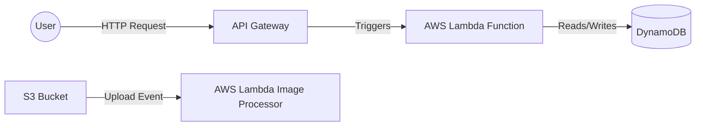

# MISC-02 Serverless and FaaS

## Overview
**Ye kya hai?** 
Serverless computing ka matlab ye nahi ki server nahi hai. Iska seedha matlab hai ki "Server ka dard apka nahi, Cloud provider (AWS/Azure/GCP) ka hai". Aapko server provisioning, OS patching, ya auto-scaling ki tension nahi leni. Aap sirf apna code likho aur deploy karo. FaaS (Function-as-a-Service) iska core part hai jahan aap apna code small functions (e.g., AWS Lambda) ke form me run karte ho.

**Kyu use hota hai?**
Traditional EC2 (VM) me aap 24/7 ka paisa dete ho, chahe server idle hi kyu na baitha ho. Serverless (Lambda) me aap sirf us "execution time" ka paisa dete ho jitni der code run hua (in milliseconds). Zero traffic = Zero cost.

**Simple Analogy:**
- **Traditional Server (EC2):** Jaise apna private driver rakhna. Gadi chale ya na chale, mahine ki salary deni padegi.
- **Serverless (Lambda):** Jaise Ola/Uber book karna. Jitna kilometer chaloge, sirf utne ka paisa dena hai.

**Industry kaha use karti hai?**
- Image processing (Jaise hi user profile pic upload kare, S3 event se Lambda trigger hoke image compress kar de).
- Cron jobs (EventBridge se Lambda trigger karna for daily database backups).
- API backends (API Gateway + Lambda + DynamoDB for fully serverless APIs).

**Architecture (Mermaid Diagram)**



## Working
**Internal Working:**
1. Code ko ZIP file ya Container image (up to 10GB) me package kiya jata hai.
2. Cloud provider background me ek ephemeral (temporary) container (microVM using Firecracker) spin up karta hai.
3. Code run hota hai, output return karta hai, aur thodi der baad container destroy ya freeze ho jata hai.
4. **Cold Start:** Jab Lambda bohot der baad call hota hai, toh naya container banne aur code load hone me 1-3 seconds lag sakte hain. 
5. **Warm Start:** Agar back-to-back requests aa rahi hain, toh purana container reuse hota hai (milliseconds me response).

**Data Flow / Request Flow:**
Event Source (API/S3/SQS) -> IAM Role Check -> Lambda Execution Environment -> Runs Handler function -> Returns Response/Logs to CloudWatch.

## Installation & Deployment Tools
Pre-requisites: AWS Account, AWS CLI, Node.js (for Serverless framework).

Serverless directly code deploy karne ke tools:
1. **Serverless Framework (`sls`):** Multi-cloud support. Uses `serverless.yml`. Industry standard for startups.
2. **AWS SAM (Serverless Application Model):** AWS native tool. Uses `template.yaml`.

## Practical Lab
**Goal:** S3 bucket me file upload hone par Lambda function trigger karna aur CloudWatch me log print karna (Using Serverless Framework).

**CLI Method (PowerShell / Bash):**
1. Install Serverless Framework:
   ```bash
   npm install -g serverless
   ```
2. Scaffold new Python template:
   ```bash
   serverless create --template aws-python3 --name s3-notifier --path s3-notifier
   cd s3-notifier
   ```
3. Update `handler.py`:
   ```python
   import json

   def hello(event, context):
       for record in event['Records']:
           bucket = record['s3']['bucket']['name']
           key = record['s3']['object']['key']
           print(f"New file uploaded: {key} in bucket {bucket}")
           
       return {"statusCode": 200, "body": json.dumps("Success!")}
   ```
4. Update `serverless.yml`:
   ```yaml
   service: s3-notifier
   provider:
     name: aws
     runtime: python3.9
     region: us-east-1
   functions:
     hello:
       handler: handler.hello
       events:
         - s3:
             bucket: my-unique-upload-bucket-999123 # globally unique
             event: s3:ObjectCreated:*
             rules:
               - suffix: .txt
   ```
5. Deploy to AWS:
   ```bash
   serverless deploy
   ```
6. **Verification:** Upload a `.txt` file in S3, run `serverless logs -f hello`.

## Daily Engineer Tasks
- **L1 Engineer:** Check CloudWatch logs for Lambda errors. Increase timeout limits if function is timing out.
- **L2 Engineer:** Fix IAM Role permissions (e.g., Lambda ko S3 access nahi mil raha). Optimize basic code issues.
- **L3/Senior Engineer:** Optimize Cold Starts using Provisioned Concurrency, reduce ZIP size using Lambda Layers, orchestrate complex workflows using AWS Step Functions.
- **DevOps/Cloud Architect:** Design fully serverless resilient architectures. Decide between ECS (Containers) vs Lambda based on cost and execution time (Lambda max limit is 15 mins).

## Real Industry Tasks
- **Migration Ticket:** Migrate an old EC2 based nightly cron job script to an EventBridge triggered AWS Lambda function to save $50/month.
- **Maintenance Work:** Update Lambda runtime from Python 3.7 (deprecated) to Python 3.10 using CI/CD pipelines.
- **Performance CR:** Implement **Lambda Layers** to extract heavy dependencies (`numpy`, `pandas`) out of the deployment package so deployment becomes 5x faster.

## Troubleshooting
**Issue:** `Function execution times out after 3 seconds.`
- **Symptoms:** Lambda logs show "Task timed out after 3.00 seconds".
- **Possible Root Cause:** Code external API ko call kar raha hai jo slow hai, ya infinite loop fas gaya hai. Lambda default timeout is 3s.
- **Investigation Steps:** Check CloudWatch logs for API response time.
- **Resolution:** Change `timeout` in `serverless.yml` to 10-30 seconds. Fix slow API calls.

**Issue:** `AccessDenied Exception when Lambda accesses DynamoDB`
- **Symptoms:** Code fails with IAM permissions error in CloudWatch.
- **Possible Root Cause:** Lambda Execution Role me DynamoDB ka `GetItem`/`PutItem` policy attached nahi hai.
- **Resolution:** Attach inline policy or add IAM roles in `serverless.yml`.

## Interview Preparation
**Basic:** What is Serverless? EC2 aur Lambda me kya difference hai?
- *Answer:* EC2 IaaS hai, Lambda FaaS hai. EC2 hourly bill hota hai, Lambda execution ms pe bill hota hai.

**Intermediate:** Lambda me Cold Start kya hota hai aur usko kaise fix karein?
- *Answer:* Pehli request ko process karne me lagne wala time kyunki container initialize hota hai. Fix karne ke liye Provisioned Concurrency use karte hain (keeps instances warm) ya lightweight runtime (Go/Nodejs) use karte hain.

**Advanced (FAANG Scenario):** A Lambda function is attached to a private VPC to read an RDS database. Users are complaining about 10-second delays.
- *Answer:* Pehle VPC attached Lambdas me ENI (Elastic Network Interface) creation slow hota tha. Halaki AWS ne Hyperplane ENI se ise improve kiya hai, RDS connection pooling ki wajah se delay ho sakta hai. Use **Amazon RDS Proxy** so Lambda functions don't exhaust DB connections during scaling spikes.

## Production Scenarios
**Scenario:** "Website Down - API Gateway throwing 502 Bad Gateway"
- **How to think:** 502 means API Gateway Lambda se connect nahi kar pa raha ya Lambda invalid response de raha hai.
- **Where to check:** API Gateway CloudWatch logs. Lambda CloudWatch logs.
- **Commands:** `sls logs -f <function_name>`
- **Root Cause:** Lambda function crashed with syntax error, OR returning an invalid JSON format (API Gateway requires exact `{statusCode, body}` format).
- **Resolution:** Fix code, redeploy.

## Commands
| Command | Purpose | Syntax/Example | When NOT to use |
| :--- | :--- | :--- | :--- |
| `serverless deploy` | Deploy entire stack via CloudFormation | `sls deploy --stage prod` | Never run from local machine directly to Production. Use CI/CD. |
| `serverless logs` | Tail logs | `sls logs -f hello -t` | Large log volumes (use AWS console instead). |
| `aws lambda update-function-code` | Direct code update bypassing IaC | `aws lambda update-function-code --function-name myFunc --zip-file fileb://code.zip` | Avoid in prod. Creates config drift between codebase and AWS. Danger level: High. |

## Cheat Sheet
- **Max Execution Time:** 15 minutes (900 seconds).
- **Max Memory:** 10 GB.
- **Max Deployment Package (ZIP):** 50MB zipped, 250MB unzipped. (Container image is 10GB).
- **Concurrency Limit:** 1000 per region (can be increased via AWS Support ticket).
- **Runtimes Supported:** Node.js, Python, Java, Go, Ruby, .NET, Custom (Rust, C++).

## SOP & Runbook & KB Article
**Runbook: Handling Lambda Concurrency Limits**
- **Detection:** CloudWatch Alarm on `Throttles` metric > 0.
- **Investigation:** Check if one rogue Lambda is eating all 1000 concurrent executions, starving other production Lambdas.
- **Resolution:** Go to AWS Console -> Lambda -> Set "Reserved Concurrency" on the rogue function to a limit (e.g., 100) so it doesn't drain the account-level pool.
- **Validation:** Check `Throttles` metric dropping for other functions.

## Best Practices & Beginner Mistakes
**Best Practices:**
- Always separate business logic from the handler function for easy unit testing.
- Store secrets (DB passwords) in AWS Secrets Manager, NOT in environment variables.
- Keep deployment packages small.
- Avoid Recursive Loops! (e.g., S3 triggers Lambda -> Lambda writes to same S3 -> Triggers Lambda again -> Infinite Loop = Massive AWS Bill!).

**Beginner Mistakes:**
- Mistake: Using Lambda for long-running batch jobs (e.g., 30 min video rendering).
- Impact: Process will kill at 15 minutes. Data corruption.
- Correct approach: Use AWS Batch or ECS Fargate.

## Advanced Concepts
- **Lambda Layers:** A ZIP archive that contains libraries. Lets you keep your deployment package small.
- **Provisioned Concurrency:** Keeps your functions initialized and warm. Eliminates cold starts but costs extra hourly money.
- **Firecracker MicroVM:** The open-source virtualization technology built by AWS (in Rust) that powers Lambda and Fargate, allowing microVMs to boot in milliseconds.

## Related Topics & Flashcards & Revision
- [[Master Index]]
- [[MISC-03 Infrastructure Testing]]
- [[Containers vs Serverless]]
- [[AWS API Gateway]]

**Flashcards:**
- Q: What happens if Lambda runs over 15 minutes? -> A: It timeouts and gets killed forcibly.
- Q: How to handle DB connections in Lambda? -> A: Use RDS Proxy.

**Revision:** 
- 5 min: Read Cheat Sheet. 
- 15 min: Read Architecture & Troubleshooting.
- Interview revision: Focus on Cold Starts, Concurrency, and VPC networking.
