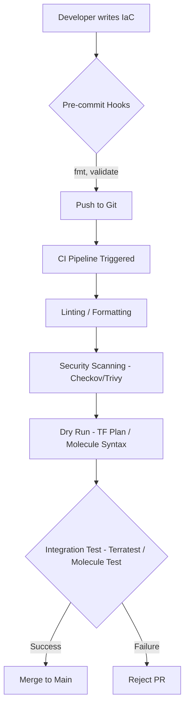

# MISC-03 Infrastructure Testing

# Overview
Ye kya hai? Just like software application code, Infrastructure as Code (IaC) ko production mein deploy karne se pehle test karna zaroori hai. Ek choti si typo in Terraform ya Ansible puri production environment ko down kar sakti hai. Isliye hum linting, security scanning (SAST), dry runs, aur actual integration testing karte hain.
Kyu use hota hai? Taaki infrastructure deployments predictable, secure, aur bug-free ho. 
Real life example: Ghar (Infrastructure) banane se pehle architect blueprint check karta hai (validate), safety inspector security dekhta hai (Checkov scan), aur ek 3D model dikhata hai ki banne ke baad kaisa dikhega (plan). Uske baad ek chota sample room bana kar check kiya jata hai ki paint kaisa lag raha hai, aur phir use tod diya jata hai (Terratest).
Industry kaha use karti hai? Har modern company Terraform ya Ansible code ko CI/CD (e.g., GitHub Actions, GitLab CI) ke through test karti hai before merging.



# Working
Internal working kaise hota hai? 
1. **Static Analysis (SAST for IaC):** Tools like Checkov and Trivy source code parse karte hain offline, bina API ko hit kiye. Ye tools ruleset (policies) ke against match karte hain (e.g., "Is S3 encryption disabled?").
2. **Dry Run:** `terraform plan` cloud provider ki API se baat karke current state check karta hai aur execution plan banata hai ki kya change hoga.
3. **Integration Testing:** Terratest aur Molecule dynamically resources banate hain. Molecule Docker ya VM spin up karta hai, Ansible role run karta hai (converge), verification karta hai (pytest-testinfra), aur cleanup karta hai (destroy). Terratest cloud resources banata hai (AWS/Azure) aur test karta hai.

# Installation
Prerequisites: Python, Go, Terraform, Ansible, Docker.
Installation:
```bash
# Checkov for Terraform Security Scanning
pip install checkov

# Molecule for Ansible Testing
pip install "molecule[docker]" ansible-lint pytest-testinfra

# Terratest dependencies (Go)
go mod init test
go get github.com/gruntwork-io/terratest/modules/terraform
```

# Practical Lab
**Lab 1: Checkov in GitHub Actions (Security Scanning for Terraform)**
1. Ek insecure Terraform file banao:
```bash
mkdir tf-test && cd tf-test
cat <<EOF > main.tf
resource "aws_s3_bucket" "my_bucket" {
  bucket = "my-insecure-bucket-123"
}
EOF
```
2. Locally run karke check karo:
```bash
checkov -d .
```
Expected Output: FAILED for missing encryption, missing versioning, etc.
3. GitHub Actions CI/CD mein integrate karo (`.github/workflows/checkov.yml`):
```yaml
name: Checkov Scan
on: [push, pull_request]
jobs:
  scan:
    runs-on: ubuntu-latest
    steps:
      - uses: actions/checkout@v3
      - name: Run Checkov
        uses: bridgecrewio/checkov-action@master
        with:
          directory: .
          framework: terraform
```

**Lab 2: Ansible Molecule Testing**
1. Naya role initialize karo:
```bash
molecule init role my_nginx_role --driver-name docker
cd my_nginx_role
```
2. Molecule test suite run karo:
```bash
molecule test
```
Expected Output: Docker container spin up hoga, playbook chalega, idempotence check hoga, aur finally container destroy ho jayega.

# Daily Engineer Tasks
- **L1 Engineer:** Terraform validate and fmt run karna. Basic CI pipeline failures ko report karna.
- **L2 Engineer:** Checkov warnings resolve karna. Molecule tests run karke idempotence fix karna.
- **L3/Senior Engineer:** Terratest test-cases likhna. Custom Checkov policies banana (using Python or YAML). OPA (Open Policy Agent) integrate karna.

# Real Industry Tasks
- **Real Change Request:** S3 buckets public nahi hone chahiye. DevOps engineer OPA ya Checkov CI/CD pipeline mein lagata hai taaki koi dev galti se bhi public bucket approve na kar sake.
- **Migration Work:** Ansible roles ko naye OS (e.g., Ubuntu 20.04 to 22.04) pe move karna. Molecule multiple OS containers spin up karke same role test karta hai automatically.

# Troubleshooting
- **Symptom:** CI Pipeline fails on Checkov scan intentionally, but the risk is accepted.
  - **Possible Cause:** Strict policy execution.
  - **Resolution:** Add skip comment in code: `# checkov:skip=CKV_AWS_20: "Need public access for website hosting"`.
- **Symptom:** Molecule tests fail during `create` phase.
  - **Possible Cause:** Docker desktop/daemon is not running.
  - **Resolution:** Start Docker and ensure `docker ps` works. Check `pip install docker`.
- **Symptom:** Molecule fails on idempotence check.
  - **Possible Cause:** Ansible task har baar state change kar raha hai (e.g., using `command` module instead of a standard declarative module).
  - **Resolution:** Use `creates:` flag ya `changed_when: false` in Ansible task.
- **Symptom:** Terratest leaves orphaned resources behind.
  - **Possible Cause:** Go test crashed/panicked before `defer terraform.Destroy()` executed.
  - **Resolution:** Clear resources manually or run `aws-nuke` script nightly in the test account. Write robust error handling.

# Interview Preparation
- **Basic:** What is the difference between `terraform validate` and `terraform plan`? (Validate checks syntax offline, Plan checks API and shows execution plan).
- **Intermediate:** Why is testing for idempotence important in Ansible? (Ansible desired state manage karta hai. Agar playbook har baar service restart karegi toh production outage ho sakta hai. Molecule runs it twice and expects 0 changes second time).
- **Advanced / Scenario Based:** How do you enforce that all EC2 instances must have a specific tag (e.g., 'CostCenter') before they are deployed? (Use Checkov, tfsec, or HashiCorp Sentinel in CI/CD pipeline to parse the IaC and block PRs without specific tags).
- **Production FAANG Level:** Describe a full IaC testing pyramid pipeline. (Pre-commit hooks for fmt/validate -> SAST via Checkov -> Dry run/Plan generation -> Policy as Code validation via OPA -> Ephemeral sandbox integration test via Terratest -> Destroy sandbox -> Apply to Dev -> Promote to Prod).

# Production Scenarios
- **Scenario:** Developer created an RDS with `publicly_accessible = true` in a PR.
  - **How to think:** How can we block this automatically without human intervention?
  - **Resolution:** CI pipeline runs Checkov -> checkov detects `CKV_AWS_17` -> Fails the build -> Developer must fix it to get a green tick. Human reviewer saves time and security breach is prevented automatically.

# Commands
| Command | Purpose | Syntax | Danger Level |
|---|---|---|---|
| `terraform fmt` | Formats code recursively | `terraform fmt -recursive` | Safe |
| `terraform validate` | Validates syntax and internal references | `terraform validate` | Safe |
| `checkov -d .` | Runs security scan in current directory | `checkov -d ./infra` | Safe |
| `molecule test` | Full lifecycle test for Ansible role | `molecule test` | Safe (sandbox) |
| `go test -v` | Runs Terratest files | `go test -v -timeout 30m` | Medium (Creates Infra) |

# Cheat Sheet
- **IaC Testing Pyramid:** Format -> Lint -> SAST -> Plan -> Integration Test.
- **Checkov:** Python-based, SAST for IaC, scans Terraform, K8s, ARM, CloudFormation.
- **Molecule Lifecycle:** dependency -> lint -> cleanup -> destroy -> syntax -> create -> prepare -> converge -> idempotence -> side_effect -> verify -> cleanup -> destroy.
- **Terratest:** Go-based integration testing framework. Uses `defer` to ensure resource cleanup upon test completion.

# SOP & Runbook & KB Article
**SOP for IaC Pull Requests:**
- Purpose: Ensure zero broken or insecure infra code reaches production.
- Procedure:
  1. Developer pushes code.
  2. GitHub Actions runs formatting, linting (tflint), and SAST (Checkov).
  3. If passed, runs `terraform plan` and attaches output to PR comment.
  4. Mandatory code review by Senior Engineer.
  5. Merge to main -> triggers `terraform apply`.
- Rollback: Revert the PR and pipeline runs plan/apply automatically.

# Best Practices & Beginner Mistakes
- **Best Practice:** Run fast tests early (shift-left). Enable Pre-commit hooks for `fmt` and `validate`.
- **Beginner Mistake:** Writing custom bash scripts to test infrastructure instead of using standard frameworks like Terratest or Molecule.
- **Beginner Mistake:** Forgetting to add `defer terraform.Destroy(t, terraformOptions)` in Terratest, leading to massive AWS bills from uncleaned testing resources.

# Advanced Concepts
- **Policy as Code (PaC):** Open Policy Agent (OPA) with Rego language. It evaluates JSON plans against strict compliance rules (e.g., "Cannot deploy RDS outside us-east-1").
- **Terratest Wait Strategies:** Implementing custom retry loops with exponential backoff because cloud resources (like EKS or RDS) take 10-15 minutes to become fully available before you can test against their endpoints.

# Related Topics & Flashcards & Revision
- [[MISC-02 Terraform Best Practices]]
- [[MISC-04 CI-CD Pipelines]]
- [[K8S-10 OPA and Gatekeeper]]
- **Flashcards:** 
  - Q: What does Checkov do? A: Scans IaC for security misconfigurations.
  - Q: What tool is used to test Ansible roles? A: Molecule.
- **Revision:** Revise Molecule lifecycle (5 min). Practice Checkov skip comments (15 min). Write a basic Terratest script (30 min).

# Real Production Logs & Commands & Decision Tree
**Checkov Output Log:**
```
Check: CKV_AWS_20: "S3 Bucket has an ACL defined which allows public READ access."
        FAILED for resource: aws_s3_bucket.data_bucket
        File: /main.tf:10-15
        Guide: https://docs.bridgecrew.io/docs/s3_1-acl-read-access
```
- **Explanation:** Checkov tells you exactly the rule violated (CKV_AWS_20), the resource name (`data_bucket`), the file/line number, and gives a direct link on how to fix the issue.

**Decision Tree for Terraform Testing Failure:**
- TF Apply fails -> Is it a syntax error? -> Run `terraform validate`.
- If syntax is OK -> Is it a security policy violation? -> Check Checkov/OPA pipeline logs.
- If security is OK -> Is it an API limit/permission issue? -> Check Cloud Provider IAM/Quotas and re-run `terraform plan`.
