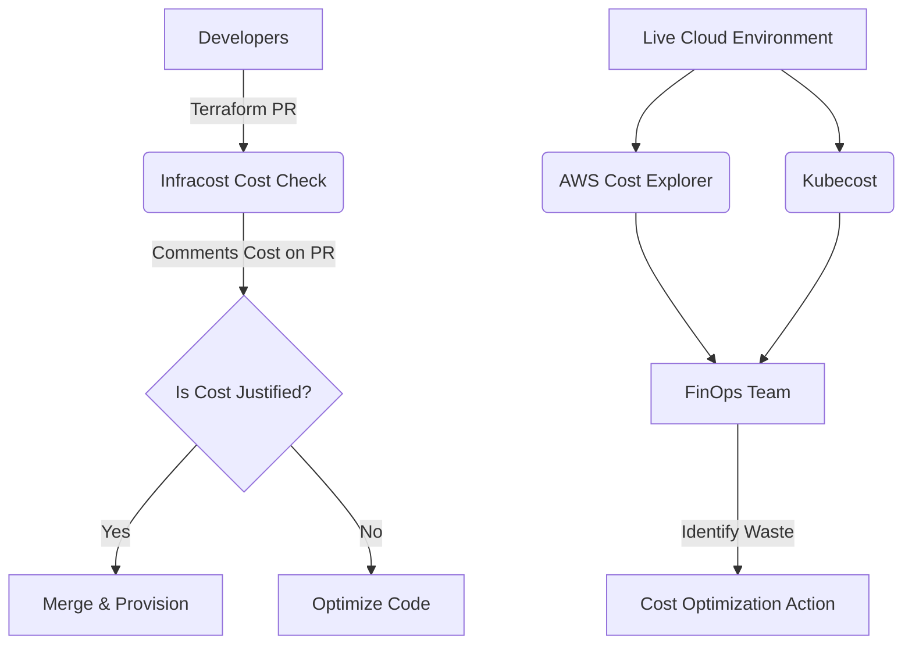
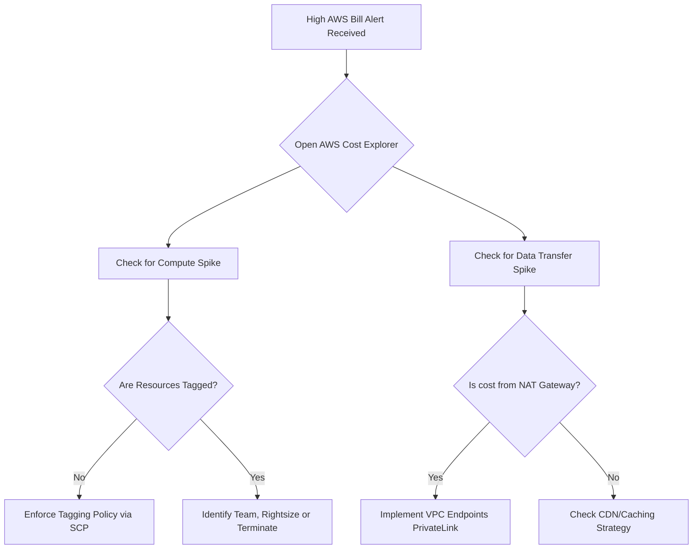

# MISC-04 FinOps Cloud Cost Management

# Overview
**Ye kya hai? Kyu use hota hai?**
FinOps (Financial Operations) cloud computing ke environment mein financial accountability laane ki practice hai. Pehle servers kharidne ke liye mahino lagte the (CapEx - Capital Expenditure), par cloud mein ek junior engineer ek click se $10,000 ka bill phaad sakta hai (OpEx - Operational Expenditure). FinOps ensure karta hai ki cloud spend optimized ho bina performance aur speed compromise kiye.

**Real life example / Simple Analogy:**
Maan lo aapke ghar ka AC. Pehle Window AC aata tha, jiska fixed cost (CapEx) ek baar lagta tha. Ab Cloud ek Smart Meter wale AC jaisa hai (Pay-as-you-go). Agar aap AC on chhod kar holiday pe chale gaye, toh bill aasmaan chhu lega. FinOps wo smart thermostat hai jo aapko batayega ki "Bhai, AC khali kamre me chal raha hai, band kar do ya temperature badha do!"

**Industry kaha use karti hai? Real production use-case:**
Companies AWS/Azure/GCP pe lakho dollars spend karti hain. FinOps practices use karke wo wasteful resources (e.g., unattached EBS volumes, idle EC2 instances) detect karti hain. Infracost aur Kubecost jaise tools use kiye jaate hain cost predict karne ke liye aur unused resources automatically band karne ke liye.



# Working
FinOps mainly teen phases mein kaam karta hai:
1. **Inform:** Visibility dena. Teams ko unke bill ka hissa dikhana (Cost Allocation via Tags).
2. **Optimize:** Paise bachane ke tareeqe dhundna. (Right-sizing, Spot Instances, Reserved Instances/Savings Plans).
3. **Operate:** Process ko automate karna aur cost-aware culture banana.

**Internal Working (Data Flow):**
- **Billing API/CUR:** Cloud providers (AWS) ek Cost and Usage Report (CUR) generate karte hain. 
- **Tags:** Resources ko tag (e.g., `Team: Frontend`) kiya jata hai, jis-se CUR report map hoti hai.
- **Infracost Flow:** PR -> CI/CD Pipeline -> `infracost diff` -> Cloud Pricing API -> Post comment on GitHub/GitLab.
- **Kubecost Flow:** EKS/AKS -> Prometheus Metrics -> Cross-reference with Node prices -> Output namespace level cost.

# Installation
Hum yaha **Infracost** ka setup dekhenge jo ki shift-left cost estimation ka standard tool hai.

**Prerequisites:** Terraform installed, GitHub/GitLab account, Infracost API key.

**Step-by-Step Installation (CLI Method - Linux/Mac):**
```bash
# 1. Download and install Infracost
curl -fsSL https://raw.githubusercontent.com/infracost/infracost/master/scripts/install.sh | sh

# 2. Verify installation
infracost --version

# 3. Register for free API key (needed for fetching live pricing)
infracost register
```

# Practical Lab
**Scenario:** Ek Terraform file bana kar uska cost breakdown nikalna, fir instance type change karke PR comment simulate karna.

**Step 1:** Dummy Terraform create karo.
```bash
mkdir finops-lab && cd finops-lab
cat <<EOF > main.tf
provider "aws" { region = "us-east-1" }
resource "aws_instance" "web" {
  ami           = "ami-0c55b159cbfafe1f0"
  instance_type = "t3.micro"
}
EOF
```

**Step 2:** Breakdown cost nikalo.
```bash
infracost breakdown --path .
```
*Expected Output:* Aapko table dikhega jisme `t3.micro` ka monthly estimation hoga (e.g., ~$7.60/mo).

**Step 3:** Generate diff (Cost spike simulate karo).
```bash
# Change t3.micro to m5.4xlarge
sed -i 's/t3.micro/m5.4xlarge/g' main.tf

# See the difference
infracost diff --path .
```
*Expected Output:* Ye batayega ki cost kitne se badh raha hai (+$550/mo spike). Is command ko pipeline me use karte hain PR automated comment ke liye.

# Daily Engineer Tasks
- **L1 Engineer:** Unattached volumes delete karna, obsolete snapshots hatana, underutilized EC2 instances ko stop/terminate karna on weekend.
- **L2 Engineer:** Tagging policies enforce karna, AWS Cost Explorer me daily anomaly check karna, Infracost ko CI/CD pipeline me integrate karna.
- **L3/Senior Engineer:** Reserved Instances (RIs) aur Savings Plans purchase plan banana, Spot instance architecture design karna EKS ke liye. Kubernetes level pe Kubecost deploy karke team-wise chargeback implement karna.
- **Platform/Production Engineer:** Build auto-remediation workflows. Jaise ki idle resources detect hote hi Slack bot se approval maang kar terminate karna.

# Real Industry Tasks
- **Orphaned Resource Cleanup:** Har mahine AWS me unattached Elastic IPs aur EBS volumes find karke clean karna.
- **Auto-Stopping Non-Prod:** Lambda + EventBridge setup karna jo Friday raat ko sabhi `env=dev` tagged instances ko rok de, aur Monday subah start kare. Is-se flat 30% saving hoti hai.
- **NAT Gateway Optimization:** Agar intra-VPC ya S3 communication NAT ke through ho raha hai (jo expensive hai), toh VPC Endpoints (PrivateLink) setup karke traffic free/cheap route se bhejna.

# Troubleshooting
**Problem:** Infracost shows "No supported resources detected".
- **Symptom:** Infracost output blank hai ya error de raha hai.
- **Root Cause:** Path galat diya gaya hai ya Terraform code me syntax error hai.
- **Fix:** Ensure karo ki `--path` us directory ko point kar raha hai jaha `main.tf` rakha hai. `terraform init` chalakar phle validate karo.

**Problem:** AWS bill me NAT Gateway cost achanak shoot up ho gaya.
- **Symptom:** Cost Explorer me "EC2 - Other" item bohot high dikh raha hai.
- **Investigation:** Check karo kaunsa private instance external internet se heavily data pull/push kar raha hai (VPC Flow Logs dekho).
- **Resolution:** Agar data S3/DynamoDB ya kisi AWS service ka hai, toh uske liye VPC Endpoints laga do.

# Interview Preparation
**Basic:**
- **Q:** CapEx vs OpEx me kya difference hai?
- **A:** CapEx (Capital Expenditure) me hardware upfront buy karna padta hai (Data Center). OpEx (Operational Expenditure) me resources pay-as-you-go model (Cloud) me rent karte hain.

**Intermediate:**
- **Q:** Spot Instances kab use karne chahiye aur kab nahi?
- **A:** Spot instances (up to 90% cheap) stateless, fault-tolerant workloads ke liye badiya hain (e.g., Background workers, Batch processing, CI/CD runners). Database ya critical real-time APIs ke liye inko kabhi use nahi karte kyunki AWS inko 2-minute warning dekar terminate kar sakta hai.

**Advanced / FAANG Level Scenario:**
- **Q:** Humare EKS cluster me 10 teams apps deploy karti hain. AWS Cost Explorer se samajh nahi aa raha ki kis team ne sabse zyada resource consume kiya hai. Aap capacity planning aur chargeback kaise implement karoge?
- **A:** AWS standard tools EC2 node level par billing dikhate hain, unhe pods/namespaces ka pata nahi hota. Iske liye hum **Kubecost** deploy karenge EKS cluster me. Wo Prometheus metrics (CPU/RAM usage per pod) ko cloud pricing API se map karke accurately namespace ya label ke hisaab se (Team-wise) cost split kar dega. Isse chargeback aur showback easily ho jayega.

**Rapid Fire:**
- Tool to check TF cost in PR? -> *Infracost*
- Expensive data transfer out mechanism? -> *NAT Gateway*
- AWS cheaper long-term commitment option? -> *Savings Plans / Reserved Instances*

# Production Scenarios
**Scenario:** "AWS bill crossed threshold alert received at 3 AM."
- **How to think:** Ghabrana nahi hai. Turant root cause (kis service ne bill badhaya) dhundna hai.
- **Where to check:** AWS Cost Anomaly Detection ya Cost Explorer me jao. Filter by 'Service' and 'Tag'.
- **Investigation:** Pata chala ki Data Science team ne 50 p4d (GPU) instances spin-up kiye aur experiment ke baad terminate karna bhool gaye hain.
- **Resolution:** Immediately un instances ko stop/terminate karo agar wo clearly unused hain. Team lead ko tag karke incident ticket raise karo.

# Commands
| Command | Purpose | Syntax/Example | Danger Level |
|---|---|---|---|
| `infracost diff` | Compare changes and show cost impact | `infracost diff --path .` | Low |
| `aws ce get-cost-and-usage` | Fetch AWS billing data via CLI | `aws ce get-cost-and-usage --time-period Start=2023-10-01,End=2023-10-31 --granularity MONTHLY --metrics "BlendedCost"` | Low |
| `kubectl get pods --field-selector status.phase=Failed` | Find failed pods wasting cluster resources | `kubectl get pods -A --field-selector status.phase=Failed` | Low |
| `aws ec2 delete-volume` | Delete unattached EBS volume | `aws ec2 delete-volume --volume-id vol-049df...` | High (Data loss risk) |

# Cheat Sheet
- **Compute Optimization:** Right-sizing karo. Spot Instances (Stateless) aur Savings Plans (Stateful/24x7) ka balance banao.
- **Storage Optimization:** S3 Lifecycle Rules set karo (Standard -> Infrequent Access -> Glacier Deep Archive). Unattached EBS volumes ko automate karke delete karo.
- **Network Optimization:** Data transfer ko same region/AZ me rakho. Use VPC Endpoints instead of NAT Gateway for AWS internal APIs.
- **Tools:** Infracost (IaC PR cost), Kubecost (K8s chargeback), AWS Cost Explorer (Native billing), CloudHealth (Enterprise FinOps).

# SOP & Runbook & KB Article
## SOP: Orphaned Resource Cleanup
- **Purpose:** Cloud waste reduce karna.
- **Scope:** Monthly hygiene activity.
- **Procedure:** 
  1. EC2 Console me jao -> Volumes -> Filter by `State: Available` (yani ye kisi EC2 me attached nahi hain).
  2. Snapshot ID verify karo. Agar backup nahi hai to snapshot le lo.
  3. Action -> Delete Volume.
  4. VPC -> Elastic IPs -> Filter by `Unassociated`. Inhe release kar do.
- **Validation:** AWS Billing dashboard me check karo, estimated run-rate gir jayega.

# Best Practices & Beginner Mistakes
**Best Practices:**
- Tag everything! (e.g., `Env: Prod`, `CostCenter: 104`, `Owner: DevOpsTeam`). Bina tags ke cloud billing black-box jaisi hai.
- Hamesha budget alerts (AWS Budgets / GCP Budgets) laga ke rakho, jo Slack pe notify kare jab 80% limit cross ho.
- Shift-cost-left: Infracost ko GitLab CI / GitHub Actions me integrate karke developer ko feedback turant do.

**Beginner Mistakes:**
- *Mistake:* NAT Gateway use karna huge S3 downloads ke liye. *Impact:* Massive data transfer charges lag jayenge. *Fix:* S3 Gateway VPC Endpoint use karo jo totally free hai.
- *Mistake:* Dev/Test idle environments ko weekends me running chhod dena. *Impact:* Flat 28% (2 din out of 7) cost waste. *Fix:* Auto-shutdown lambdas use karo.

# Advanced Concepts
**FinOps Maturity Model:**
1. **Crawl:** Basic visibility aati hai, manual reporting hoti hai, team reactive mode me high bills handle karti hai.
2. **Walk:** Automated alerts set hain, basic tagging compliance ho gayi hai, aur rightsizing chalu hai.
3. **Run:** CI/CD me automated cost checks (Infracost) hain, 100% tag compliance mandatory hai via Azure Policy/AWS SCP, automated remediation active hai, aur K8s chargeback implemented hai.

# Related Topics & Flashcards & Revision
- [[MISC-02 Serverless and FaaS]] (Pay per execution, extreme cost savings for spiky traffic)
- [[K8S-01 Architecture and Components]] (Understand pods/nodes to master Kubecost)
- [[AWS-01 VPC and Networking]] (To understand NAT Gateway vs VPC Endpoint pricing)

**Flashcards:**
- **Q:** Kubernetes Cluster ka internal resource cost split karne ke liye industry standard tool kya hai? | **A:** Kubecost
- **Q:** Terraform PRs pe hi cost estimate dikhane ke liye kaunsa tool shift-left approach use karta hai? | **A:** Infracost

# Real Production Logs & Commands & Decision Tree
**Infracost CI/CD Output Example (GitHub PR Comment):**
```diff
+ aws_instance.web
+  ├─ Instance usage (Linux/UNIX, on-demand, t3.micro)
+  │   ├── Cost: $7.60/mo
+  └─ root_block_device
+      └─ Storage (general purpose SSD, gp2)
+          └── Cost: $0.80/mo

Monthly cost change for project: +$8.40/mo
```
*Meaning:* Is PR ko merge karne se infrastructure me ek EC2 add hoga, jisse AWS bill me lagbhag 8.4 dollar har mahine badh jayega. Developer isko dekh kar approve ya reject kar sakta hai before actual creation.


